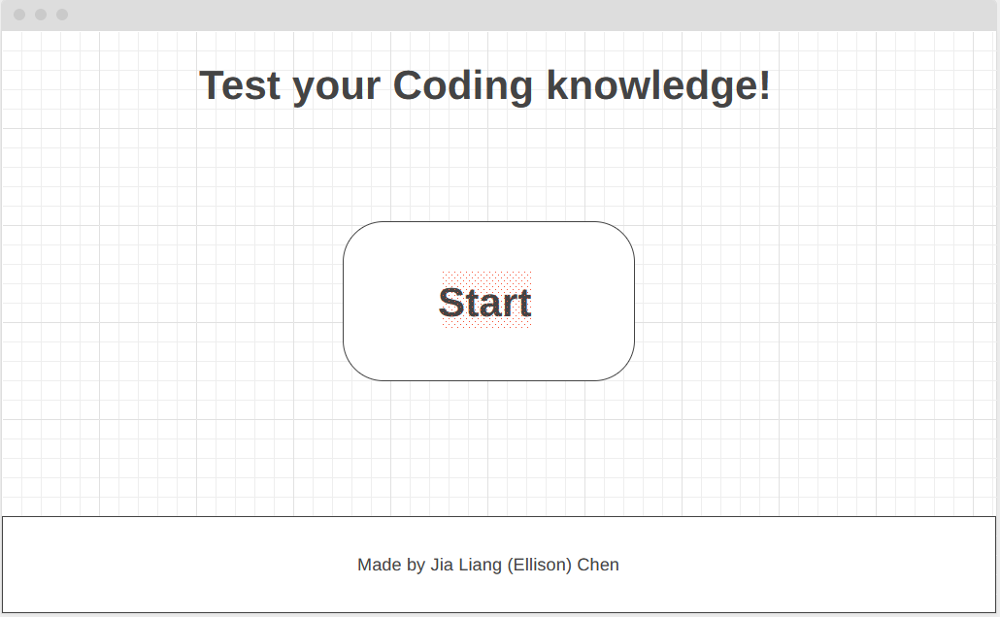
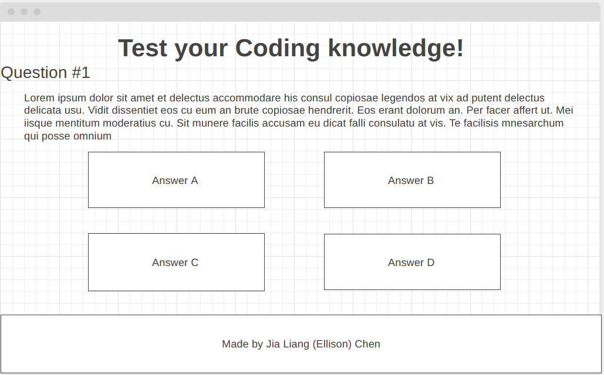

# Coding_Quiz Game

## Description

Quiz game based on JavaScript, HTML, and CSS.

## Table of Contents

1. [Motivation](#motivation)
2. [Images](#images)
3. [Installation](#installation)
4. [Credits](#credits)
5. [License](#license)

## Motivation
To display skillset of HTML and CSS as well as ocasional JavaScript through projects linked through this portfolio.

## Images
### Images of wireframe plan:

### Images of working site:

![]

## Installation
The webpage was launched using Github Pages at https://ellisjlc.github.io/Coding_Quiz/.

1. Run program.
2. Click start button.
3. Play game.

## Credits
All images provided within the webpage and in the README.md were created personally by Jia Liang (Ellison) Chen.

## License
MIT License

Copyright (c) 2022 Horiseon

Permission is hereby granted, free of charge, to any person obtaining a copy
of this software and associated documentation files (the "Software"), to deal
in the Software without restriction, including without limitation the rights
to use, copy, modify, merge, publish, distribute, sublicense, and/or sell
copies of the Software, and to permit persons to whom the Software is
furnished to do so, subject to the following conditions:

The above copyright notice and this permission notice shall be included in all
copies or substantial portions of the Software.

THE SOFTWARE IS PROVIDED "AS IS", WITHOUT WARRANTY OF ANY KIND, EXPRESS OR
IMPLIED, INCLUDING BUT NOT LIMITED TO THE WARRANTIES OF MERCHANTABILITY,
FITNESS FOR A PARTICULAR PURPOSE AND NONINFRINGEMENT. IN NO EVENT SHALL THE
AUTHORS OR COPYRIGHT HOLDERS BE LIABLE FOR ANY CLAIM, DAMAGES OR OTHER
LIABILITY, WHETHER IN AN ACTION OF CONTRACT, TORT OR OTHERWISE, ARISING FROM,
OUT OF OR IN CONNECTION WITH THE SOFTWARE OR THE USE OR OTHER DEALINGS IN THE
SOFTWARE.
